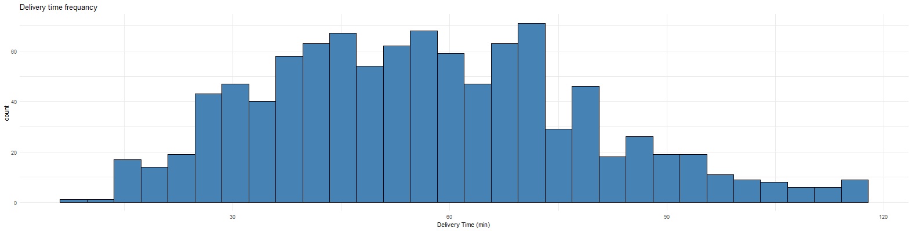
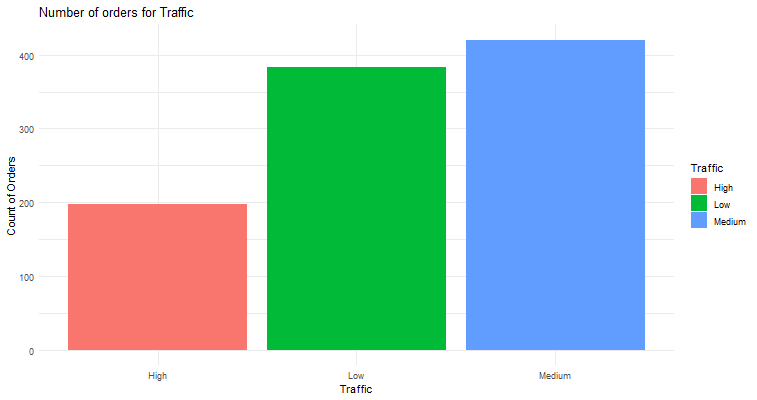
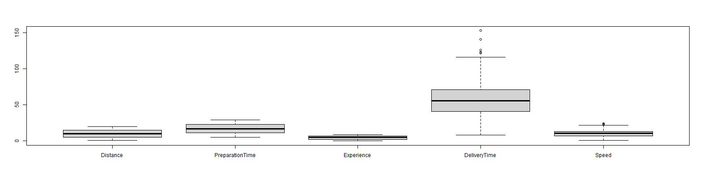
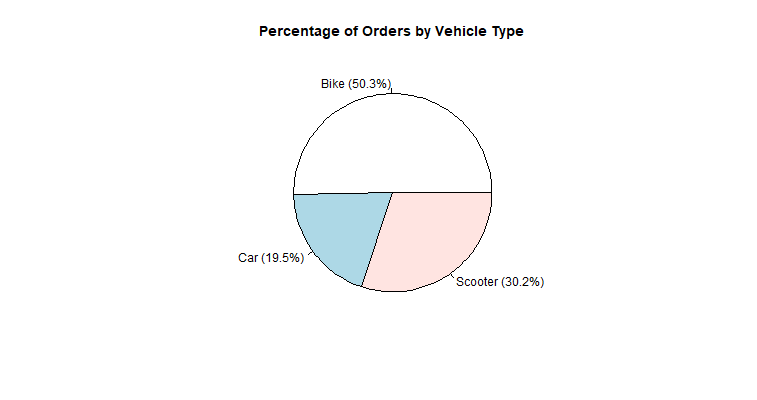
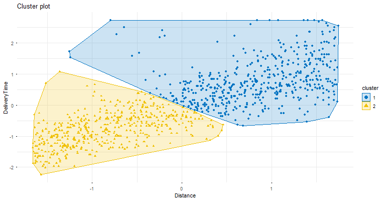
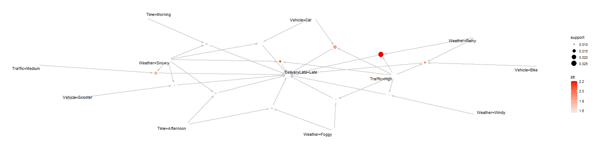
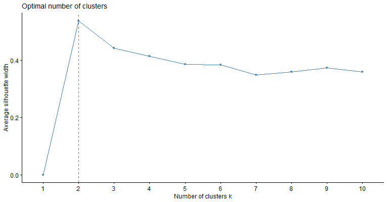

# 1.Introduction

This project aims to analyze the dataset to uncover the key factors that contribute to delivery delays. By using various plots and graphical visualizations, the analysis highlights hidden patterns, relationships, and trends that help the company identify the main causes of delays and take appropriate actions to improve revenue and customer satisfaction.

# 2. Data Preparation

## 2.1. Uploading

The project accepts data directly from the user through two methods: uploading a file or manually adding a new row. This allows the analysis to dynamically adjust based on the structure and content of the dataset provided.

## 2.2. Cleaning

### 2.2.1. Columns rename

After receiving data, Rename cols to be easy for use and readable

```{r echo=TRUE}
library(dplyr)
data <- read.csv("./Food_Delivery_Times.csv")
data <- data %>% rename(
  OrderID = Order_ID,
  Distance = Distance_km,
  Weather = Weather,
  Traffic = Traffic_Level,
  Time = Time_of_Day,
  Vehicle = Vehicle_Type,
  PreparationTime = Preparation_Time_min,
  Experience = Courier_Experience_yrs,
  DeliveryTime = Delivery_Time_min
)
head(data,1)
```

### 2.2.2. Handling missing values

In Categorical columns replace empty value by more frequent value in column.

In Numerical columns replace empty value by median value of column.

### 2.2.3. Outliers Treatment

Detecting outliers values in numerical columns and show if higher than replace by max value in boxplot if lower than replace by lower value in boxplot

``` r
num_cols <- names(df)[sapply(df, is.numeric)]
for (col in num_cols) {
  Q1 <- quantile(df[[col]], 0.25, na.rm = TRUE)
  Q3 <- quantile(df[[col]], 0.75, na.rm = TRUE)
  IQR_val <- IQR(df[[col]], na.rm = TRUE)

  lower <- Q1 - 1.5 * IQR_val
  upper <- Q3 + 1.5 * IQR_val

  df[[col]][df[[col]] < lower] <- lower
  df[[col]][df[[col]] > upper] <- upper
}
return(df)
```

### 2.2.4. Convert columns to correct types

Relevant columns were converted to correct data types. Numeric fields were transformed using `as.numeric()` and categorical variables were converted to factors. This step ensures accurate computations and consistent data handling.

``` r
data <- data %>%
      mutate(
        OrderID = as.integer(OrderID),
        Weather = as.factor(Weather),
        Traffic = as.factor(Traffic),
        Time = as.factor(Time),
        Vehicle = as.factor(Vehicle),
        Experience = as.numeric(Experience),
        Distance = as.numeric(Distance),
        PreparationTime = as.numeric(PreparationTime),
        DeliveryTime = as.numeric(DeliveryTime)
      )
```

## 2.3. New Features

Two new features were created to enhance the dataset. The **Speed** feature was calculated to measure delivery efficiency, while the **Delivery Late Flag** was added as a binary indicator showing whether a delivery exceeded its expected time. These features support better analysis and model performance.

``` r
data$Speed <- data$Distance / (data$DeliveryTime/60)
```

**Delivery Late Flag** added by detect 3rd quarter values in **Delivery Time**

``` r
Q3 <- quantile(data$DeliveryTime, 0.75)
```

And compare detect values in quarter 3 and 4 to be late

``` r
data$DeliveryLate <- as.factor(ifelse(data$DeliveryTime >= Q3, "Late", "Ontime"))
```

# 3. Data Analysis

## 3.1. Kmeans (Unsupervised Learning)

**Kmeans** was applied to group similar delivery records, helping to identify patterns that lead to **quick or slow deliveries**. Key factors affecting delivery performance, such as **long distance or slow service**, were highlighted through clustering.

## 3.2. Apriori (Association Rule)

**Apriori** was applied to discover patterns and relationships between factors that contribute to **late** or **fast** deliveries. This helps identify combinations of conditions that affect delivery performance.

# 4. Data visualization

Several visualizations were used to better understand data patterns and delivery behavior

## 4.1. Distribution plots ( Histograms )

Use histograms to examine the spread of delivery times, distances, and speeds

``` r
ggplot(data, aes(DeliveryTime)) +
      geom_histogram(fill = "steelblue", color = "black") +
      labs(x = "Delivery Time (min)", title = "Delivery time frequancy") +
      theme_minimal()
```



## 4.2. Bar charts plots

Use bar charts to compare categorical variables such as count of orders by categorical

``` r
ggplot(data, aes(x = Traffic, fill = Traffic)) +
        geom_bar() +
        labs(
          title = paste("Number of orders for","Traffic"),
          y = "Count of Orders",
          x = "Traffic"
        ) +
        theme_minimal()
```



## 4.3. Box-plots

Use box-plots to detect outliers



## 4.4. Correlation heat map

Use correlation heat map to identify relationships between numeric features (e.g., distance vs. delivery time)

``` r
cor_matrix <- cor(df)
ggcorrplot(cor_matrix,
           hc.order = TRUE, type = "lower",
           lab = TRUE, lab_size = 3,
           method = "square", colors = c("blue", "white", "red")
)
```


## 4.5. Pie-Chart

Use pie-chart to show the proportion of each category in the dataset, providing a quick view of the overall distribution



## 4.6. Scatter (points)

Used to **Cluster visualization** to show K-Means groupings



## 4.7. Association rules graphs

Using to visualize Apriori rule support, confidence and lift and understand patterns lead to late or on time



# 5. Project Features

## 5.1. Optimal number of cluster

This feature present important suggestion to choose best number for cluster based on current data



## 5.2. Notifications

This feature present show notification when user add new record can be success or error if user add exist id

## 5.3. Validation

Added validation technique to check if new data follow valid structure or no

``` r
required_cols <- c(
  "Order_ID",
  "Distance_km",
  "Preparation_Time_min",
  "Courier_Experience_yrs",
  "Delivery_Time_min",
  "Weather",
  "Traffic_Level",
  "Time_of_Day",
  "Vehicle_Type"
  )
  
if (!all(required_cols %in% colnames(user_data))) {
  showNotification("Invalid dataset file!", type = "error")
  return(NULL)
}
```

## 5.4. Download data

Can user download data in file after do analysis

``` r
output$download_data <- downloadHandler(
        filename = function() {
          paste("food_delivery_data-", Sys.Date(), ".csv", sep = "")
        },
        content = function(file) {
          write.csv(data, file, row.names = FALSE)
        }
      )
```

# 6. Conclusion

The project can provide answers to questions such as

-   What are the primary factors that cause late deliveries ?

-   Find hidden patterns in delayed deliveries

-   Can delivery orders be grouped into meaningful clusters?

-   What do these clusters represent?

-   What specific actions can the company take to reduce delays?
